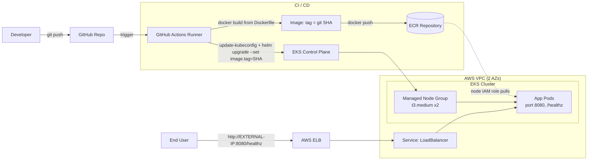

# Architecture

End-to-end view: **GitHub → GitHub Actions → ECR → EKS → Application**, including
the traffic flow to external exposure.

## System diagram

## Traffic flow (exposure)

1. The `LoadBalancer` Service provisions an AWS ELB (enabled by the subnet tags
   from [Layer 1](01-infrastructure.md) / [Prereq #2](00-prerequisites.md)).
2. External user → ELB → Service → Pod on port `8080`.
3. `GET /healthz` returns `200` once the readiness probe passes.

## Deployment flow (CI/CD)

See [deployment-flow.md](deployment-flow.md) for the push-to-pod narrative.

1. Developer pushes code to GitHub.
2. GitHub Actions builds the image from the provided `Dockerfile`.
3. The image is tagged with the **git SHA** (immutable) and pushed to ECR.
4. The runner runs `helm upgrade`, injecting the new tag.
5. EKS pulls the new image from ECR (via the node IAM role — no pull secret) and
   rolls out the new version.

> **Note on the diagram tool:** this is a Mermaid diagram so it renders directly
> on GitHub. If a polished visual is needed for submission, it can be exported via
> a diagramming tool — but Mermaid satisfies the "Architecture Diagram" deliverable.
