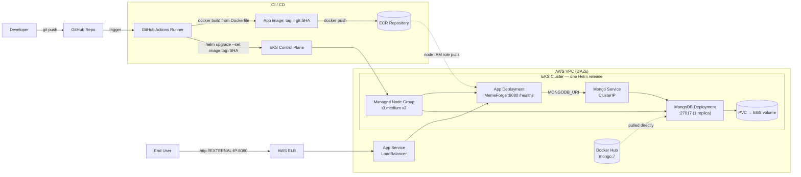

# Architecture

End-to-end view: **GitHub → GitHub Actions → ECR → EKS → Application + MongoDB**,
including the traffic flow to external exposure. One Helm release deploys **two
workloads** — the MemeForge app and an in-cluster MongoDB.

## System diagram

## Workloads (the two Deployments)

1. **MemeForge app** — Deployment (scalable via `replicaCount`) + a
   `LoadBalancer` Service on port `8080`. Reads `MONGODB_URI` from a Secret.
2. **MongoDB** — single-replica Deployment + a `ClusterIP` Service on `27017`,
   backed by a PersistentVolumeClaim (EBS volume). Internal only — never exposed.

## Traffic flow (exposure)

1. The app's `LoadBalancer` Service provisions an AWS ELB (enabled by the subnet
   tags from [Layer 1](01-infrastructure.md) / [Prereq #2](00-prerequisites.md)).
2. External user → ELB → app Service → app Pod on port `8080`.
3. The app talks to MongoDB **inside the cluster** via the Mongo `ClusterIP`
   Service (`MONGODB_URI`); the database is not reachable from outside.
4. `GET /healthz` returns `200` once the readiness probe passes; `GET /readyz`
   returns `200` once MongoDB is connected.

## Images in play

| Image | Source | Pulled by | Auth |
|-------|--------|-----------|------|
| App (built from `Dockerfile`) | **ECR** | app Deployment | node IAM role (no secret) |
| `mongo:7` | **Docker Hub** | MongoDB Deployment | public image (no secret) |
| `course/sample-app:1.0.0` | Docker Hub | Layer 2 smoke test only | public image |

## Deployment flow (CI/CD)

See [deployment-flow.md](deployment-flow.md) for the push-to-pod narrative. The CI
builds and pushes **only the app image**; MongoDB uses the official image and
isn't rebuilt. `helm upgrade` updates the release; only the app's image tag
changes between releases, and MongoDB's data persists on its PVC.

> **Note on the diagram tool:** this is a Mermaid diagram so it renders directly
> on GitHub. If a polished visual is needed for submission, it can be exported via
> a diagramming tool — but Mermaid satisfies the "Architecture Diagram" deliverable.
